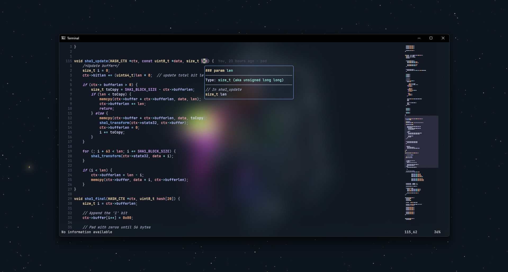

# My NVim Config



> If you want to add this config to your nvim. Clone this repository at `~/.config/nvim` (linux) or `%USERPROFILE%\AppData\Local\nvim` (windows), and source the `lua.config.init.lua` file with `:so`, the `:PackerSync` it. 

## Remaps
```lua
-- while in normal mode
"leader" = " "  -- vim.g.mapleader set to space bar
"<leader>pv" = vim.cmd.Ex  -- access explorer
"<leader>s" = vim.cmd.vsp  -- split screen

-- while in insert mode
"<C-x>" = "<Esc>"  -- exit insert mode
```

## CMP
```lua
"<C-b>" = cmp.mapping.scroll_docs(-4)
"<C-f>" = cmp.mapping.scroll_docs(4)
"<C-Space>" = cmp.mapping.complete()
"<C-e>" = cmp.mapping.abort()
"<CR>" = cmp.mapping.confirm(...)
```

## Fugitive
```lua
-- while in normal mode
"<leader>gs" = vim.cmd.Git  -- access git status
```

## Harpoon
```lua
-- while in normal mode
"<leader>a" = mark.add_file
"<C-e>" = ui.toggle_quick_menu  -- open menu
"<C-h>" = ui.nav_file(1)
"<C-t>" = ui.nav_file(2)
"<C-n>" = ui.nav_file(3)
"<C-s>" = ui.nav_file(4)
```

## LSP
```lua
-- while in normal mode
"gd" = vim.lsp.buf.definition
"K" = vim.ls.buf.hover
"gr" = vim.lsp.buf.referemces
"<leader>rn" = vim.lsp.buf.rename
```

## Telescope
```lua
-- while in normal mode
"<leader>pf" = builtin.find_files
"<C-p>" = builtin.git_files  -- git files search
"<leader>ps" = function() ... end  -- open grep search
```

## UndoTree
```lua
-- while in normal mode
"<leader>u" = vim.cmd.UndotreeToggle
```
